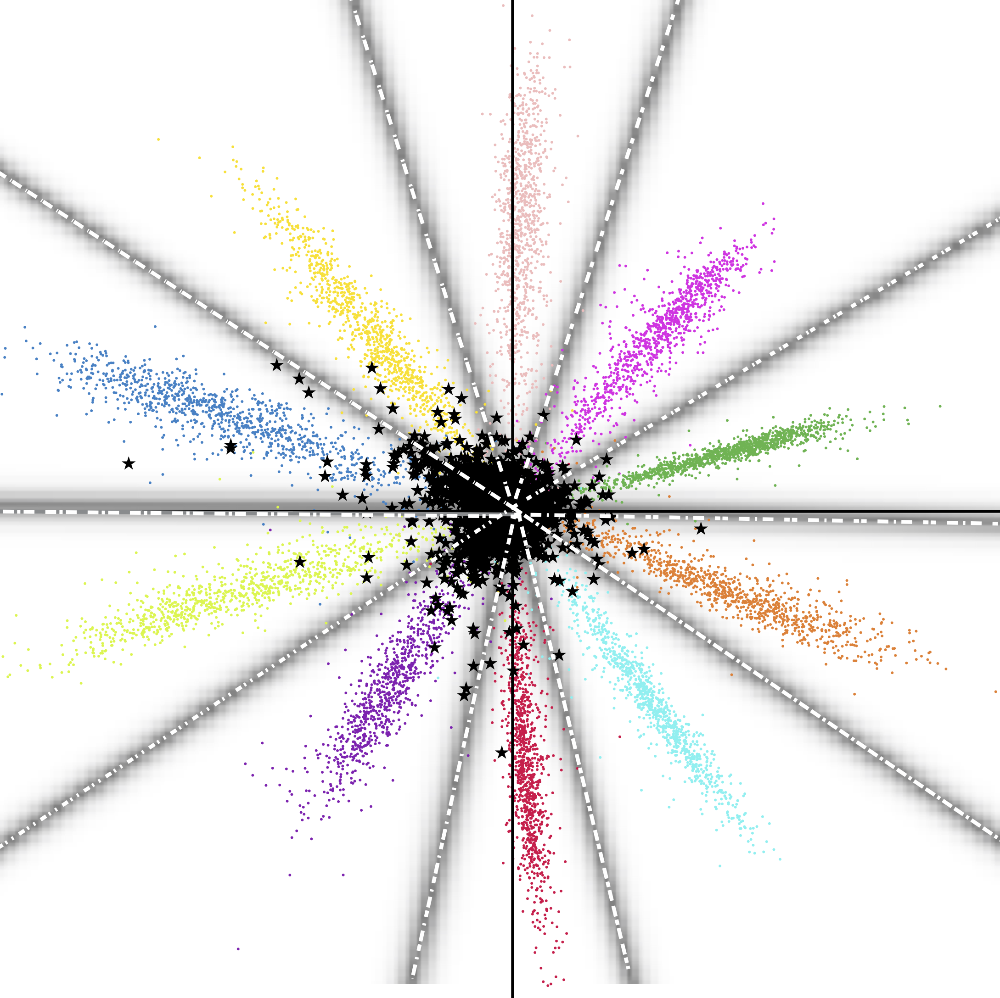

# Understanding Open Set Recognition

**December 15, 2024** | *Computer Vision & Deep Learning*

[← Back to Blog](../index.html)

---

## Introduction

In traditional machine learning, we train models on a closed set of classes and expect them to classify inputs into one of these known classes. However, real-world applications rarely operate under such constraints. When deploying a model in production, it will inevitably encounter inputs that don't belong to any of the training classes. This is where **open set recognition** becomes crucial.



## The Challenge

Consider a face recognition system trained to identify employees at a company. In a closed-set scenario, the system would always try to match any face to one of the known employees, even if the person is a visitor or intruder. This is obviously problematic! The system needs to be able to say "I don't know this person" when encountering unknown individuals.

> *"The real challenge in machine learning isn't just recognizing what you know, but also knowing what you don't know."*

## Key Concepts

Open set recognition requires models to:

- **Detect unknowns:** Identify when an input doesn't belong to any known class
- **Maintain accuracy:** Still correctly classify known classes
- **Reject gracefully:** Handle unknown inputs without degrading performance
- **Adapt over time:** Potentially incorporate new classes as they appear

## Approaches and Solutions

Several approaches have been developed to tackle open set recognition, including:

- **Threshold-based methods:** Setting confidence thresholds for rejection
- **Distance-based approaches:** Measuring distance from known class distributions
- **Generative models:** Learning what "known" data looks like and rejecting outliers
- **Extreme Value Theory:** Modeling the tail distributions of known classes

In my research, I've explored using the **Objectosphere loss**, which creates compact class representations with well-defined boundaries. This makes it easier to detect when a sample falls outside the known space. You can read more about this work in my [publications](../../index.html#three).

## Code Example

Here's a simple example of how you might implement a threshold-based rejection mechanism in Python:

```python
import numpy as np
from scipy.special import softmax

def open_set_predict(logits, threshold=0.8):
    """
    Predict class with open set rejection.
    
    Args:
        logits: Raw model outputs
        threshold: Confidence threshold for rejection
    
    Returns:
        predicted_class: Class index or -1 for unknown
        confidence: Prediction confidence
    """
    probabilities = softmax(logits)
    max_prob = np.max(probabilities)
    predicted_class = np.argmax(probabilities)
    
    if max_prob < threshold:
        return -1, max_prob  # Unknown class
    
    return predicted_class, max_prob

# Example usage
model_output = np.array([2.1, 0.5, 0.3, 1.2])
pred_class, confidence = open_set_predict(model_output, threshold=0.7)

if pred_class == -1:
    print(f"Unknown class detected (confidence: {confidence:.2f})")
else:
    print(f"Predicted class: {pred_class} (confidence: {confidence:.2f})")
```

## Real-World Applications

Open set recognition is critical in many domains:

- **Security systems:** Detecting unauthorized individuals
- **Medical diagnosis:** Identifying when a case falls outside trained categories
- **Autonomous vehicles:** Recognizing unexpected objects on the road
- **Quality control:** Detecting novel defects in manufacturing

## Conclusion

As deep learning models are increasingly deployed in real-world scenarios, open set recognition will become even more important. We need systems that can confidently say "I don't know" rather than forcing uncertain predictions. This is an active area of research with many exciting challenges ahead.

**Further Reading:**
- Check out my papers on [Reducing Network Agnostophobia](https://arxiv.org/pdf/1811.04110.pdf)
- [Objectosphere approach](../../index.html#three) for more technical details

---

[← Back to Blog](../index.html)

